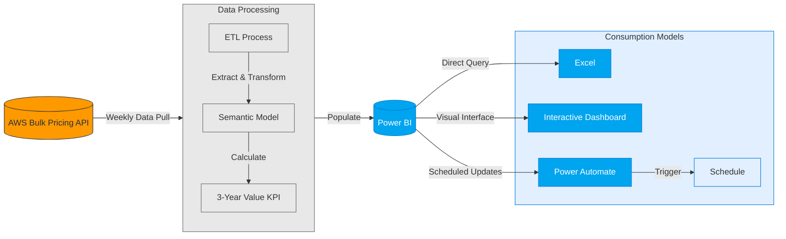
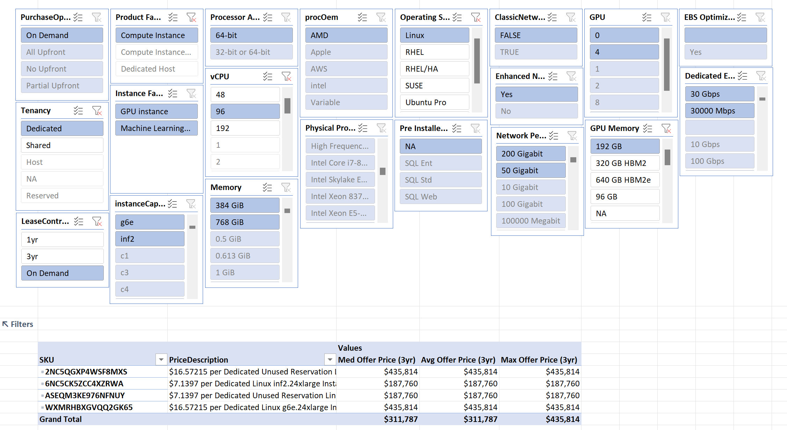
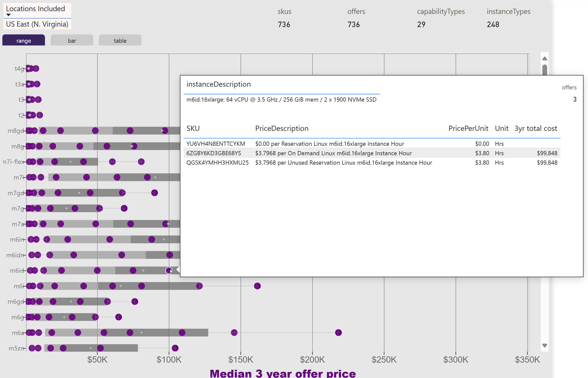

---

layout: post
title: EC2 Cost Estimation 

---

# Optimizing Cloud Infrastructure Pricing Early in the Design Phase

Making smart architecture decisions early can dramatically impact your cloud computing costs. Let's explore how AWS EC2 cost estimation tools can help you build cost-effective solutions from day one.

## Why Early Cost Estimation Matters

When designing cloud services, seemingly minor architectural decisions can lead to massive cost differences over time. Getting accurate cost projections early helps you make more accurate ROI determinations, and avoid expensive re-architectures later when your service is already in production.

The [EC2 cost explorer](https://github.com/pgaljan/EC2-Instance-Explorer) is a proof of concept that provides comprehensive pricing data for over 340,000 SKUs in the US-East catalog, enabling you to precisely estimate costs based on your specific technical requirements and contract arrangements. With weekly updates, you can make informed decisions throughout your development process.

## Behind the Data

The cost explorer is powered by a semantic model that pulls information directly from the AWS Bulk pricing API for the US-East region every week. It calculates a standardized **three-year value** for each SKU, creating a consistent baseline for comparison.

## How to Use the EC2 Cost Explorer

### Programmatic Analysis
Excel provides the most flexible way to work with this data. Since everything is pre-fetched and standardized on a 3-year basis, you can easily:
- Create custom pivot tables for in-depth exploration
- Query the model directly from Excel 
- Connect through Power Platform to schedule automatic cost basis updates
- Create custom queries aligned to specific solutions for live pricing

### Visual Exploration
Users can also interactively explore the offerings through Excel Pivot Tables or PowerBI.  

##### Pivot table xploration of EC2 SKUs

##### PowerBI cost spread of AWS EC2 Instance Families

The dashboard starts with a view of shared on-demand instances without included software. From there, you can filter by:
- Technical specifications (processor architecture, pre-installed software, CPU/GPU resources)
- Storage and network capabilities
- Contract terms (upfront payments, lease length, hosting models)

The visualization suite includes:
- Box and whisker plots showing cost ranges across instance families
- Bar charts comparing similarly-sized instances across different capability tiers
- Detailed tables with median, average, and maximum values for each SKU group
- Tooltips showing the full SKU details available in the AWS catalog

### Powerful Filtering
The fine-grained filtering system lets you narrow down options by:
- Processor architecture
- Pre-installed operating systems and applications
- Compute resources (CPU/GPU)
- Storage configurations
- Network bandwidth (including guaranteed minimums)
- Contract terms and payment structures

## Real-World Design Workflow

While the visual dashboard is impressive, the most valuable use cases come from direct queries. You can:
- Create automatically refreshing custom reports
- Apply standard discount calculations
- Pre-filter by contract terms and regions relevant to your specific project

By integrating this cost information early in your design process, you can make architecture decisions that optimize for both technical requirements and financial efficiency, avoiding costly adjustments later in your development cycle.

## Integrating into your workflow

The EC2 Cost Explorer as a prototype is useful for light exploration and discovery of new EC2 services.  In production, most large-scale AWS projects typically leverage a wider array of services from a narrower set of regions, using a single contract consumption model.  Grab the the [model](https://github.com/pgaljan/EC2-Instance-Explorer) and deploy in your M365 environment (it only requires a basic PowerBI license).  Schedule updates, connect to the model from Excel, and you are ready to start customizing it to your needs.  Expand the query to pull data for catalogs for all of the services and regions that you regularly use. (you mnay need to create your own calculations for different types of unit pricing).  You can also expand it to include data from other cloud providers. 