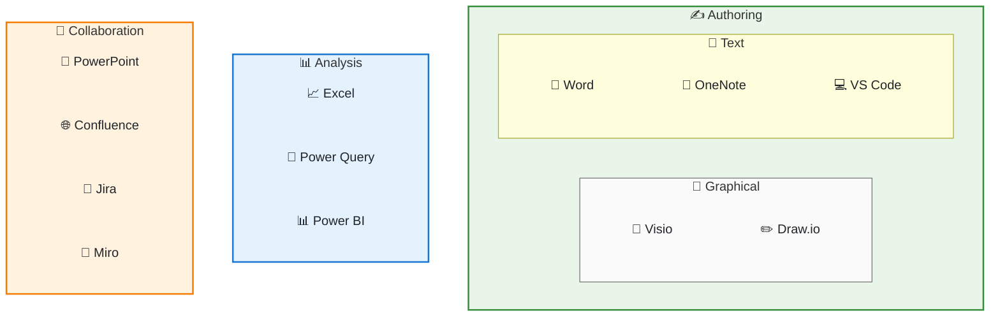

---

layout: post
title: The AI-Ready Toolchain

---

Knowledge workers are generally used to authoring in two types of tools:
- **Domain-specific tools**.  These are open source or commercial that users perform their core work in.  They are typically specific to an envrionment.  For example, an animator might use Modo professionally, but prefer to use Blender for personal projects.  
- **Domain-adjacent tools**.  These are general purpose tools for knowledge workers.  Users from many different professional backgrounds are used to using applications like Google Docs or Confluence for text authoring, Excel for data analysis, or Visio for diagramming.  These differ from domain-specific tools in that the user has great flexibility in which tools they use.  

In this post, I'll explore how this latter class of domain-adjacent toolset as a product manager has evolved and simplified, improving my fluency across the tools that I use, and making it more adaptable to generative AI workflows.

As a technical product manager, my output is highly variable, including:

- project tracking - excel
- reporting - power query
- data analysis - excel, power bi
- data visualization - excel, power bi
- simulations - power bi
- mockups - visio, powerpoint
- workflows - visio, drawio
- diagrams - visio, drawio
- rich text authoring - confluence, word, oneNote

Previous to the advent of generative AI, my toolchain was varied