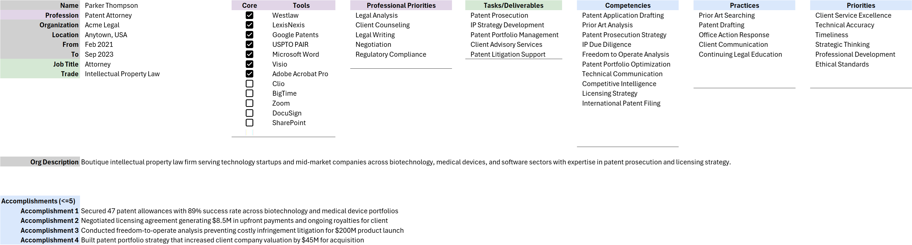
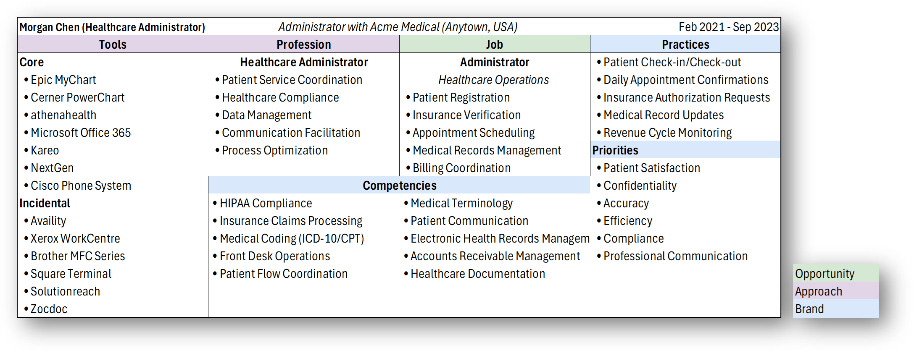
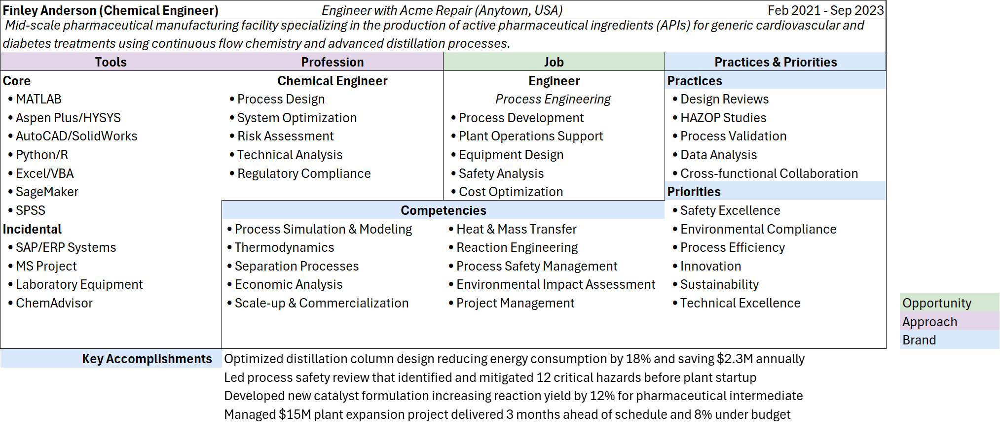
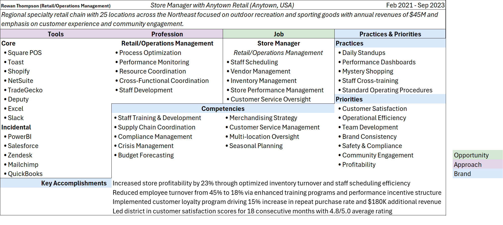
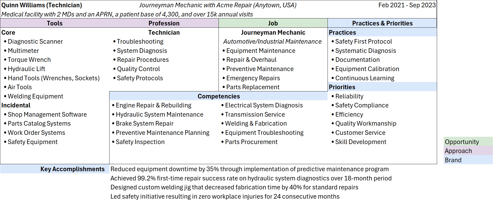
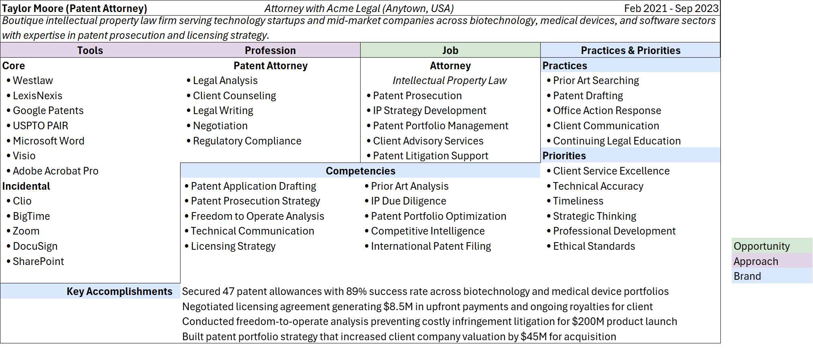

---

layout: post
title: Career Stop Framework

---

The career stop framework is a quick way to gain a full appreciation of a single work experience.  When completed, it also provides a solid initial prompt for generative AI summarization of the role.

### Using the framework
The framework is divided into four categories:

##### Job Elements
Your name, the organization, location, and date indications in text, along with a 256 character description of the job purpose and characteristics

##### Opportunity

- **Job Title** your job title, (current or aspirational)
- **Trade** your role in the industry (current or aspirational)
- **Tasks/Deliverables** 4-5 element list of the key responsibilities
  
Taken together, these categories describe what you do on a day to day basis.  

#####  Approach

- **Profession** is the career path and core methodologies you apply.  You should have a core philosophy about your approach to the profession.
- **Tools** are physical or software tools you use on a day to day basis.  **Core Tools** are critical to the job function, and with which you consider yourself adept, while you engage  **Incidental** tools on a consumer basis (rather than as author or expert)

#####  Brand

- **Competencies** indicate the output you provide and activities you perform in the service of your current job.  In general, these are things that consistently be delivered using a variety of tools and methods.  For example, Excel is a tool, data analysis is a competency.
- **Practices** indicate regular activites you engage in during the execution of your job
- **Priorities** are strategic areas where you focus your continual improvement efforts
- **Accomplishments** are *explainable*, *measurable* outcomes from the application of your **Practices & Priorities** to the **Tasks/Deliverables**.

##### Examples

Here are a few examples to illustrate how the framework can be applied to a variety of industries and roles:

**Medical Office Worker**
 
**Chemist**

**Retail Manager**

**Mechanic**

**Lawyer**

Download the [excel template](../careerstop.xlsx) to leverage this framework with your career experience.

