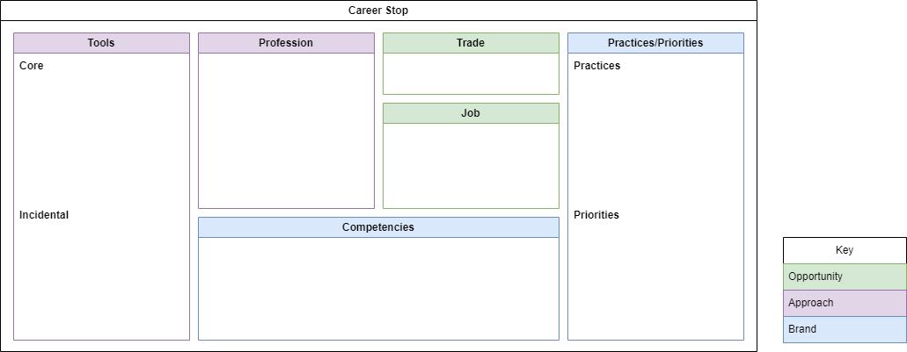
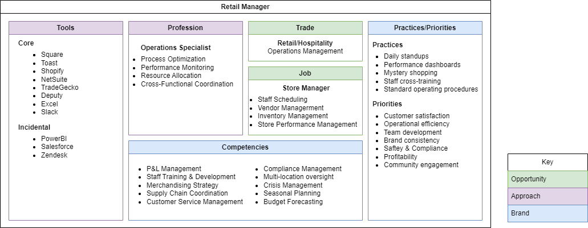
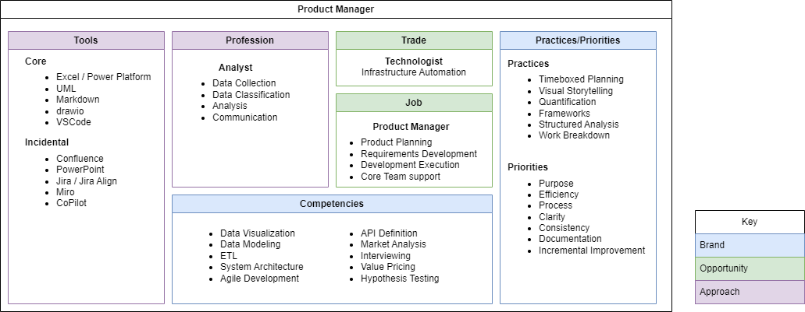
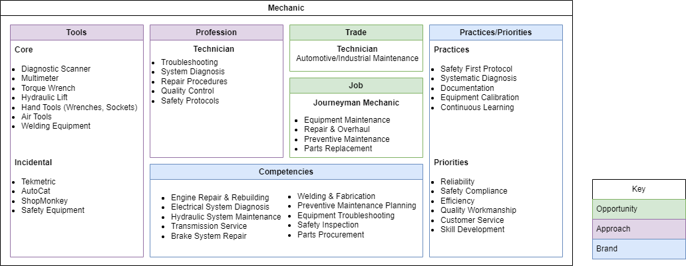
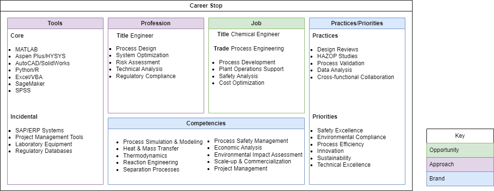

---

layout: post
title: Career Stop Framework

---

The career stop framework is a quick way to gain a full appreciation of a single work experience.  It is particularly useful for workers who have broad cross-industry experience, and need a little help tying together a full narrative and progression for their career.  When completed, it also provides a solid initial prompt for generative AI summarization of the role.

### Using the framework
The framework is divided into three categories:

##### Opportunity

Taken together, these categories describe what you do on a day to day basis.  
- **Job** reflects your job title, with a 4-5 item list of your tasks or deliverables
- **Trade** indicates your role in the industry

#####  Approach

- **Core** tools are physical or software tools you use on a day to day basis, critical to the job function, and with which you consider yourself adept.  
- **Incidental** tools are those that you engage as a consumer rather than author or expert, indicating familiarity rather than expertise.
- **Profession** is the career path and core methodologies in which you have an academic interest

#####  Brand

- **Competencies** indicate the services you provide and activities you perform in the service of your current job.  In general, these are things that consistently be delivered using a variety of tools and methods.  For example, Excel is a tool, data analysis is a competency.
- **Practices** indicate regular activites you engage in during the execution of your job
- **Priorities** are strategic areas where you focus your continual improvement efforts

Here are a few more to illustrate how it might be applied in a variety of industries and roles

**Retail Manager**

**Product Manager**

**Mechanic**

**Chemist**

