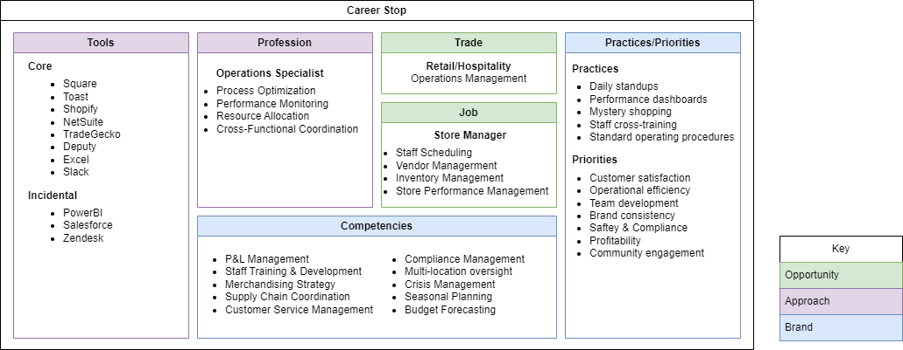
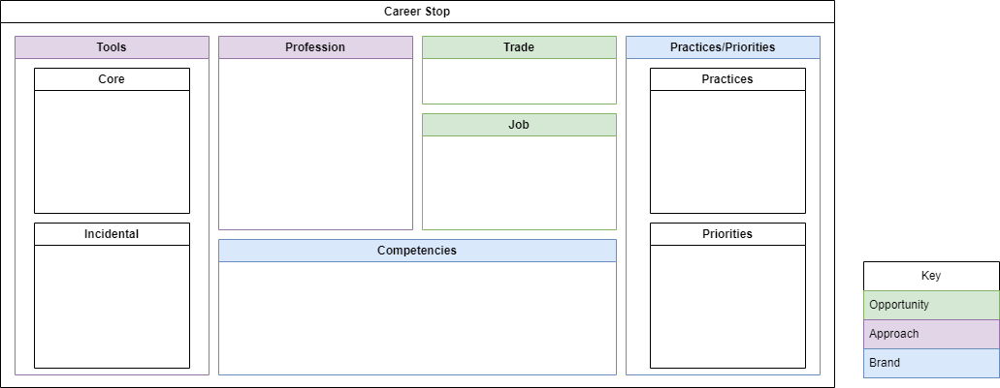

---

layout: post
title: Career Stop 

---

The career stop framework is a quick way to gain a full appreciation of a single work experience.  It is particularly useful for workers who have broad cross-inustry experience, and need a little help tying together a full narrative and progression.  When completed, it also provides a solid initial prompt for generative AI summarization of the role.

This is how a retail store manager might represent a career stop.

### Using the framework
The framework is divided into three categories, each with two subcategories.

##### Opportunity

Taken together, these categories describe of what you do on a day to day basis.  
- **Job** might roughly reflect you job title and have a very level list of your tasks or deliverables
- **Trade** indicates your role in the industry.  

#####  Approach

- **Tools** are physical or software tools you use on a day to day basis.  **Core** tools are critical to the job function, and with which you consider yourself adept.  **Incidental** tools are those that you engage as a consumer rather than author, indicating familiarity rather than expertise.
- **Profession** is the career path and core methodologies in which you have an academic interest

Taken together, these indicate immediate value that you can present to an organization.

#####  Brand

- **Competencies** indicate the services you provide and activities you perform in the service of your current job.  As a guideline, it is something that can consistently be delivered using multiple tools and methods.  For example, Excel is a tool, data analysis is a competency.
- **Practices** indicate regular activites you engage in during the execution of your job
- **Priorities** are strategic elements that on which you focus your continual improvement efforts

As a contrast to the retail example, I've included one that reflects my current career stop:

If you'd like to adapt it for yourself,  grab the SVG below:

