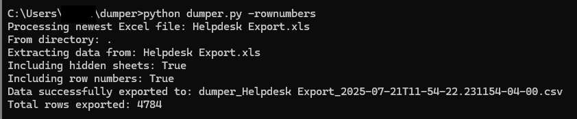

---

layout: post
title: Excel Liberation with Dumper

---

After wrestling with Excel workbooks containing dozens of hidden sheets, inconsistent formatting, and data scattered across multiple tabs, I built a simple Python tool that extracts everything into a clean, queryable CSV format. [Dumper](https://github.com/pgaljan/dumper) addresses a common frustration with a few hundred lines of automation.

## The Excel Problem

Excel is simultaneously one of the most powerful and most frustrating tools in business computing. Complex workbooks often become digital filing cabinets; multiple worksheets with related but inconsistent data structures, hidden calculations, and formatting that makes automated processing difficult.

Using Power Query is fast, but will need to be modified to adapt to most workbook formwat changes. The problem isn't Excel itself; it's that Excel workbooks are optimized for human consumption, not programmatic access.

## A Simple Solution

The dumper script solves this by flattening any Excel workbook into a single CSV file where every row is tagged with its source worksheet name. This creates a queryable dataset that preserves the original organization while making the data accessible to any tool that can read CSV files.  This pre-processing allows you to pick up the entire workbook with Power Query.  The file name contains important metadata about the source file name, when the source file was modified.  The file itself carries 

<pre><code>
# Extract everything from the newest Excel file
python dumper.py

# Process specific file and directory
python dumper.py -input ./reports -file quarterly.xlsx -output ./processed
</code></pre>

The tool automatically handles multiple Excel formats (.xlsx, .xls, .xlsm, .xlsb), filters out empty rows, and manages file naming with ISO 8601 timestamps to allow for clear identification of the source timestamp. Most importantly, it preserves the worksheet names (and optionally row numbers) as metadata, so you can still understand the original structure.

## Real-World Integration

Where dumper really shines is in automated workflows. Rather than manually extracting data each time a report is updated, you can integrate it directly into Excel using VBA and Power Query:

<pre><code>
Sub RefreshWithDumper()
    ' Run dumper on current workbook
    Shell "python dumper.py -file """ & ThisWorkbook.FullName & """ -output C:\DataLake"
    
    ' Refresh Power Query connection
    ThisWorkbook.Connections("ProcessedData").Refresh
End Sub
</code></pre>

This creates a self-updating data pipeline where your Excel workbook can export its own data and immediately reload it in a standardized format. The result is that your beautifully formatted reports can coexist with clean, analyzable datasets.

## Beyond Manual Processing

The most powerful applications come when you stop thinking about dumper as a one-off extraction tool and start treating it as infrastructure:

- **Automated ETL**: Schedule dumper to process incoming reports and feed them into your data warehouse
- **Version Control**: Use the timestamped outputs to track how your data changes over time
- **Quality Assurance**: Compare extracted data across versions to identify formatting inconsistencies
- **Cross-System Integration**: Bridge Excel-based workflows with modern analytics platforms

I've seen teams use dumper to create automated dashboards that update whenever someone drops a new Excel file in a shared folder. The extracted CSV files become the single source of truth, while the original Excel files remain available for their intended human-readable purpose.

## Lessons Learned

Building dumper reinforced several principles about automation tools:

- **Start with real pain**: This tool exists because I was tired of manual Excel wrestling, not because Python data processing seemed interesting
- **Preserve context**: Tagging each row with its source worksheet and optionally its row number prevents data from becoming anonymous and uninterpretable  
- **Handle edge cases gracefully**: Real Excel files have hidden sheets, merged cells, and inconsistent formatting
- **Make integration easy**: The most useful automation is the kind that disappears into existing workflows

## Getting Started

Dumper requires minimal setup—just Python with pandas and openpyxl. The [GitHub repository](https://github.com/pgaljan/dumper) includes comprehensive documentation and examples for everything from basic extraction to Power Query integration.

The tool works particularly well when you have:
- Complex workbooks with multiple related datasets
- Regular reporting processes that could benefit from automation
- Analytics workflows that need clean, structured input data
- Teams that need to collaborate on Excel-based data without losing formatting

By treating Excel extraction as infrastructure rather than a manual task, you can maintain the flexibility and familiarity of spreadsheet-based workflows while gaining the benefits of structured, programmatically accessible data.