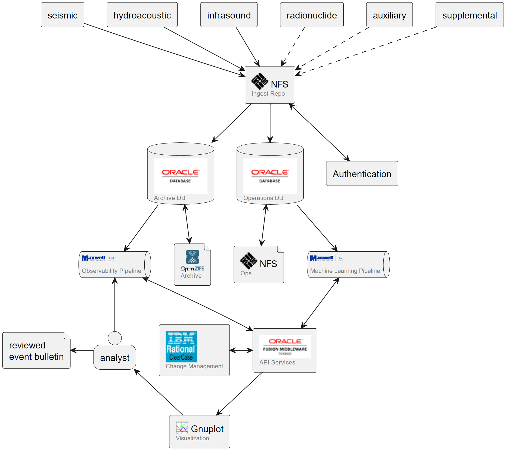
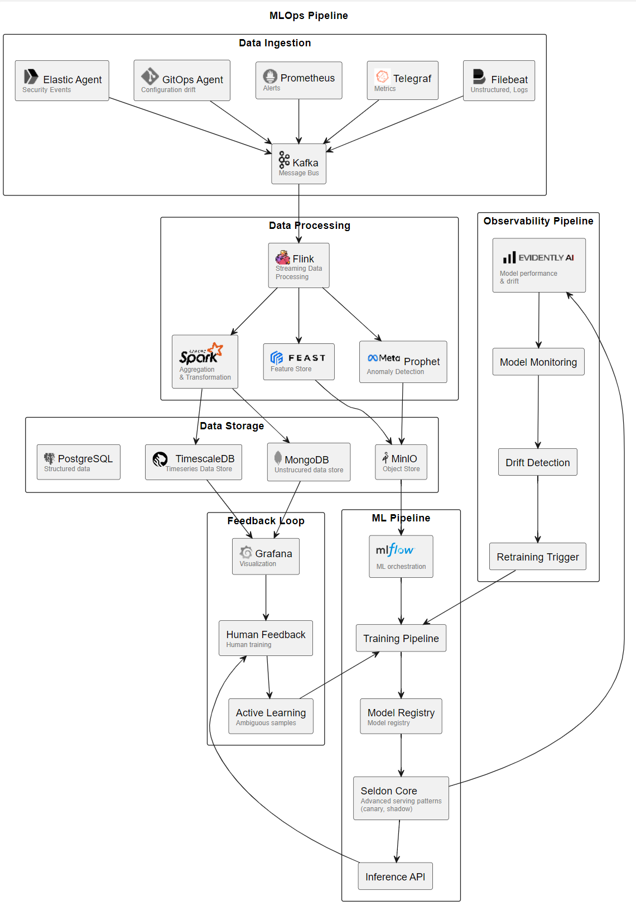

---

layout: post
title: 30 years of MLOps 
comments: true

---

A recent tour through the current Machine Learning (ML) approaches brought home how robust the space has become over the last 6-8 years.  Every layer of the ML stack seems to present at least a handful of very good choices, tuned to whatever outcome you want.  Today, I’ll compare this wealth of options to my first exposure to ML pipeline work.

# Early Days
In the late 1990s, I became involved in an experiment that included the deployment of an ML pipeline to process what at the time was considered to be a tremendous volume of time-stamped messages.  The goal of this international effort, [initiated](https://apps.dtic.mil/sti/tr/pdf/ADP204402.pdf) by DARPA for the United States and [finished](https://apps.dtic.mil/sti/citations/ADA530260) by the Defense Threat Reduction Agency, was to demonstrate the feasibility of using ML algorithms to perform automated detection and location of nuclear events (distinguishing them from natural and non-nuclear man-made events).  The experiment ultimately led to key insights into the methods of automated [multi-sensor data fusion](https://apps.dtic.mil/sti/tr/pdf/ADA374102.pdf) and anomaly detection. 

The sensors (seismic, infrasound, hydroacoustic, and radionuclide) signed and transmitted messages to a central facility, where they were authenticated and processed by a neural network pipeline for event characterization and location.  The results would be reviewed by international experts, who would publish [daily reports](https://conferences.ctbto.org/event/7/contributions/1185/attachments/136/335/P4.1-446_MDA_analysts.pdf) noting anomalous events.  Their feedback was incorporated into the observational ML pipeline; the model was constantly tuned, with formally documented releases every six months.

This looks eerily familiar to anyone who’s built a modern ML pipeline.  The functions were already there – staging areas, observational and learning pipelines, human feedback.  It even had a microservice approach, although we just called them “services”. 

Interestingly, almost all the software we used to complete the experiment is still commercially available.  Most of it is at Oracle, so one can presume that the products are even profitable.  But if you were to look around a modern AI/ML space, you would only find the open source components (ZFS and gnuplotlib). 

It was a uniquely challenging environment – people had been building these pipelines since the 1960s, but there were few commercial use cases.  Being a proof of concept, our goal was to complete the experiment, and the inefficiencies of our approaches were apparent even then.  Key enabling approaches like object storage and object databases were still in their infancy or had yet to be conceived, so we bought what we could and built the rest bespoke to the specific needs of our pipeline.  We owed our success in part to a relatively low-volume, well-characterized reference data set (<20TB), and in majority to a handful of exceptionally talented scientist-engineers with an intimate knowledge of the data and the algorithms processing it.

# The Modern Pipeline
This modern pipeline illustrated below could be narrated almost identically to its predecessor.  A tremendous amount of time-stamped data is streamed from sensors (computer logs, events, metrics, drift reports) to a centralized repository where they are processed by an ML algorithm.  Anomalies are detected and flagged for review by specialist personnel who generate bulletins and response plans.

While similar in design and outcome, the modern pipeline has evolved to be so much better in so many ways.  While it doesn’t have many new core functions, there are quite a few more boxes.  As software vendors shifted focus from software stacks to platforms, “all-in-one” stacks have been replaced by open source components purpose-built for their place in the value chain. 

Capable AI/ML software is available to all, and the hardware is almost entirely commoditized (if expensive to operate).  ML pipelines are orchestrated, with bog-standard, predictable APIs to handle everything from ingest to deployment to retraining. Observational workflows are streamlined and mostly automated.  The modularity of the pipeline makes it very easy to swap entire components for testing and comparison.

# Lessons for today
When building an ML pipeline today, the abundance of choices at every layer of the stack can be both liberating and overwhelming. Each component exists to solve a real problem, but it can be hard to tell if it’s one of your problems - that is, whether it’s a problem you’ll face in a specific technical domain, at your scale of operations, for the duration of your project.

Having witnessed this evolution from proprietary stacks to modular ecosystems, the enduring advice seems:

- Start with the business problem, let the technology follow
- Build incrementally, validating each component against your specific needs
- Aggressively replace or remove components that are not delivering value correlating to their expense or effort

ML pipelines still depend on a deep understanding of your data. and maintaining clear paths for human expertise to improve the system. The tools have become democratized, but the core principles of good ML engineering remain remarkably consistent.

<noscript>Please enable JavaScript to view the <a href="https://disqus.com/?ref_noscript">comments powered by Disqus.</a></noscript>