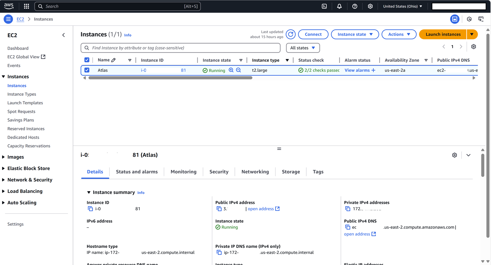
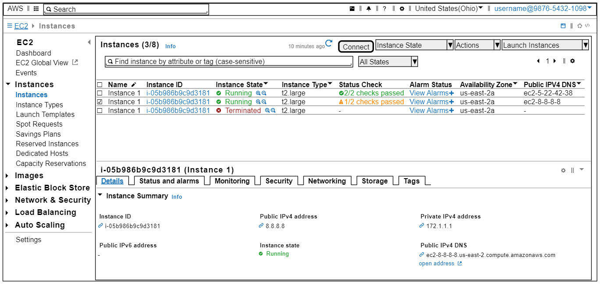

---

layout: post
title: Mockup-As-Code Using SaltUML

---

If you're working in any kind of development or planning role for a complex system, you are aware that diagram as code brings huge benefits to the architect and product owner roles.  Expressing system documentation as code allows for quick iteration, clearer collaboration, better version control and automation, all of which are critical when dealing with dynamic systems at scale.

While many people are familiar with UML renderers for things like system and sequence diagrams, I recently discovered PlantUML's Salt subproject, and it has complete changed my approach to developing rough mockups.  With Salt, you can use simple markup language to collaborate on functionally accurate interface mockups, versioning it as you would any other code.  

#### Screenshot
Consider the following screenshot of the AWS EC2 dashboard.

#### SaltUML Mockup
Here's a rough mockup that was generated with around [100 lines of SaltUML](https://github.com/pgaljan/pgaljan.github.io/blob/master/ecs-dash.puml).

## Getting Started

The learning curve is remarkably gentle. Within a few hours of experimenting, you can create functionally accurate UI wireframes. The markup language feels intuitive for anyone with basic HTML experience. Find a rendering and authoring experience that feels natural to you, whether it's a whiteboard application like [Miro](https://miro.com/diagramming/plantuml-online/), an extension to [VSCode](https://marketplace.visualstudio.com/items?itemName=jebbs.plantuml), or just playing around in the plantuml [playgrounds](https://plantuml.com/salt) with the sample code.  

Salt explicitly focuses on **function** over form.  Users with light HTML experience will find the [Creole](https://plantuml.com/creole) engine very flexible in formatting.  You can declare your own sprites, but the [Openiconic](https://plantuml.com/openiconic) library has an analog for virtually every icon I have needed.  I have gathered a handful of templates for mobile and web apps in the [salt](https://github.com/pgaljan/dac/blob/main/salt.md) section of the [dac](https://github.com/pgaljan/dac) project, which you can use regardless of the renderer you choose.  

## Results
I've observed that integrating SaltUML into my workflow improves my consistency and accuracy.  The text-based generation allows me to generate versionable assets that can be differenced and iterated on.  As I've become more fluid with the pattern, I've created a library of re-usable templates like this AWS dashboard which can be leveraged across projects, dramatically improving my scale, collaboration, and communication.