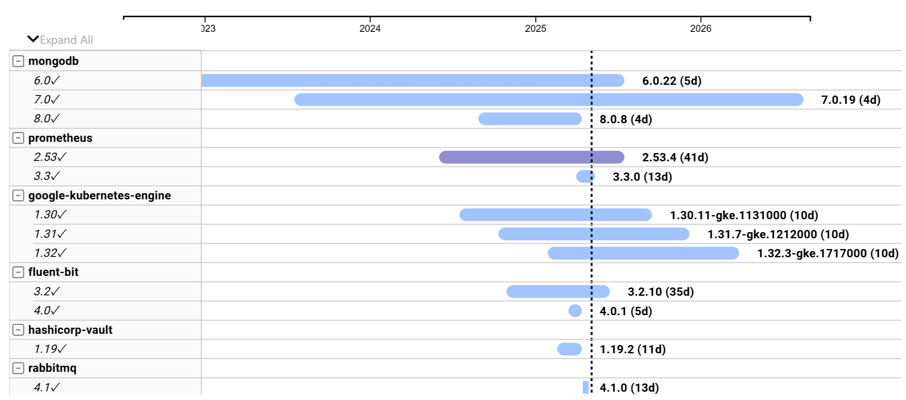

---

layout: post
title: Plot your dependencies with Lifecycle Navigator

---

Managing dependencies can be a time-consuming and sometimes frustrating part of the architect's job.  Each component's cadence can be different, so a broad understanding of a system's lifecycle cadence can feel as hopeless as predicitng shifting sands.

##### Example Dependency map

[Lifecycle Navigator](https://app.powerbi.com/view?r=eyJrIjoiYzgyYThhYzAtNDY1Ny00MWYyLWJhZmEtNjE5OGRiZWNiY2Y2IiwidCI6ImZlNGQ5NDA3LWE5NzEtNDhjMy1hOTkzLTRjMmNiOGQ2MjM4NCIsImMiOjF9) pulls software support data for a select set of release streams from [endoflife.date](https://endoflife.date/).
