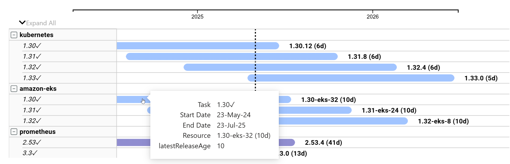
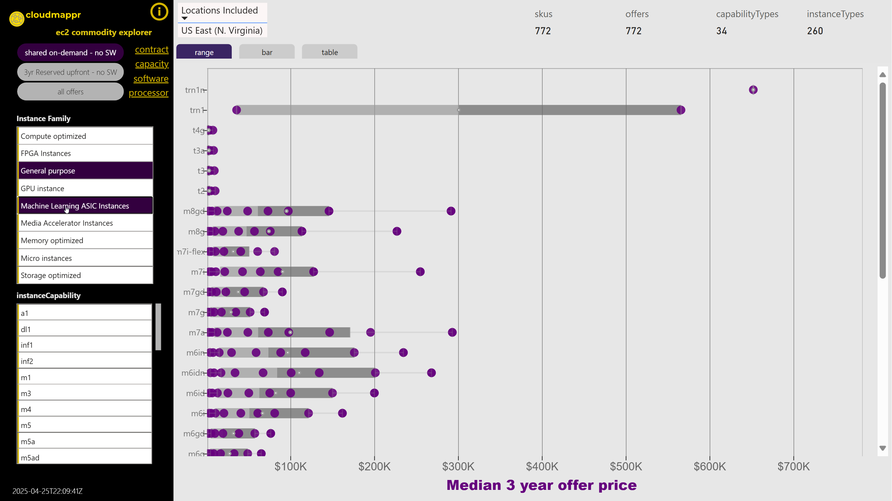
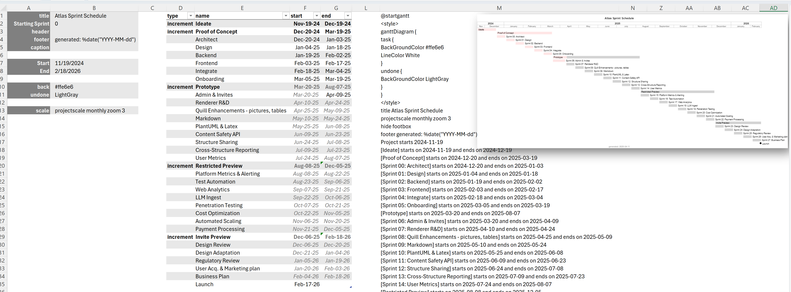

#### Software Lifecycle Navigator
Complex dependency graphs are the default with microservice architectures. [Lifecycle Navigator](https://app.powerbi.com/view?r=eyJrIjoiYzgyYThhYzAtNDY1Ny00MWYyLWJhZmEtNjE5OGRiZWNiY2Y2IiwidCI6ImZlNGQ5NDA3LWE5NzEtNDhjMy1hOTkzLTRjMmNiOGQ2MjM4NCIsImMiOjF9) visually maps release cadence and support status for over 60 software and hardware projects to assess interop and test matrix complexity. Updates weekly.

#### EC2 Commodity Explorer
Reliably estimate the price range of a solution before proof of concept. [EC2 Explorer](https://app.powerbi.com/view?r=eyJrIjoiYzRmOTY1MDYtZmE1ZC00MzA5LWFhMjYtMTIzM2Q0MWMwYjBlIiwidCI6ImZlNGQ5NDA3LWE5NzEtNDhjMy1hOTkzLTRjMmNiOGQ2MjM4NCIsImMiOjF9) gives average, median, minimum, and maximum 3 year pricing for any compute instance available in US-EAST under any contract terms.  Updates weekly

#### EasyGANTT
Leverage Excel to generate PlantUML GANTT markup.  [EasyGANTT](https://github.com/pgaljan/EasyGantt) has robust features such as zoom to time period, configurable frontmatter, auto progress indication, with mutliple timebox options.

#### Diagram and Mockup as Code
In addition to standard [UML Patterns](https://github.com/pgaljan/dac/blob/main/dac.md), the DAC project provides robust templates for data [model illustration](https://github.com/pgaljan/dac/blob/main/model.md), a small easily navigable [sprite library](https://github.com/pgaljan/dac/blob/main/sprites.md) tuned to the infrastructure architect.